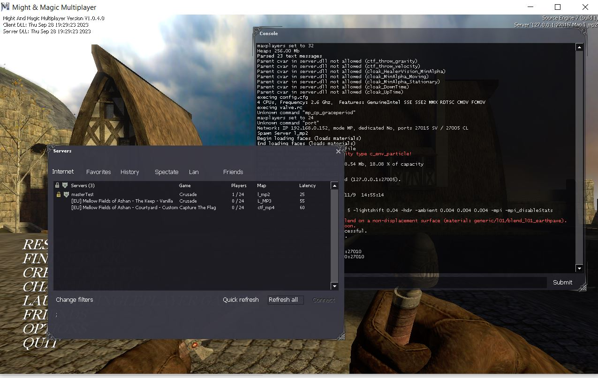

Simple implementation of the Master Server Query Protocol
https://developer.valvesoftware.com/wiki/Master_Server_Query_Protocol

It has a list of IPs configured which it sends out to game servers that are configured to query a server that hosts this MasterServer.
In addition to the configured IPs, game servers can add their IP.

Any game server is supported as long as it implements the Master Server Query Protocol. Usually older Source games like Dark Messiah of Might and Magic.


# How to use a Master Server
To configure any master server to find game servers, overwrite the .../Steam/config/masterservers.vdf file and make it read only (right click, Properties).
Put into the file:
```
"MasterServers"
{
"hl2"
    {
        "0"
        {
            "addr"        "135.125.202.170:27010"
        }
    }
}
```

135.125.202.170 is the IP of my own hosted master server, but you can replace/add any other host.

This is how it should look:



# How to add my IP to a Master Server
Dedicated servers have config files which you can update with the master server IP.

Or you can use this console command which also works with servers started from within the game:

`setmaster add 135.125.202.170:27010`

You should be able to see your game server immediately after executing this command and refreshing the 'Internet' tab.

# How to host this Master Server
Very simple by design. Just one file that can be started the usual Java way:
java MasterServer

You have to install Java (version 21) first.

By default, it uses localhost, but you may need to provide the public or local IP depending on your setup.
I run this on a Private Virtual Server (VPS) and start it from terminal with:

`nohup java MasterServer 135.125.202.170 > server.log &`

The server port is the standard 27010.

To use the restart script with cron:
```
chmod +rwx start.sh
chmod +rwx stop.sh
chmod +rwx restart.sh
crontab -e
0 4 * * * /opt/msqp/restart.sh
```
Assuming you have copied the MasterServer class into /opt/msqp


# Troubleshooting

## Cannot connect to my local master server

If you start the master server locally, using localhost or 127.0.0.1 does not work to connect to it, even though master server and the game are hosted on the same machine.
You have to use your local IP to connect to the master server.

## My game server does not appear in the list
Only responsive game servers are listed in the 'Internet' tab. The master server my return more servers than listed.
If you used the setmaster console command, but you still don't see your game server, you may need to open or forward your server port in your router.
The default port is 27015, but could be any depending on your game server configuration.


# Currently unsupported / wishlist
- tidy up and refactor code to improve readability
- filtering game server IPs
- reloading the remote IP config (requires restart)
- paging of IPs
- DDOS attack protection
- removing IPs when a game server sends the message that it is shutting down
- IP maintenance: remove unresponsive IPs
- configure port
- configure remote IP config
- persist ad-hoc IPs (all IPs added by game servers and are not in the IP config file are lost on restart)
- log level, timestamps, size config
